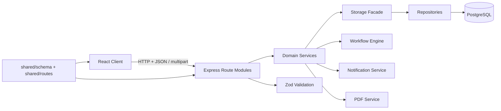
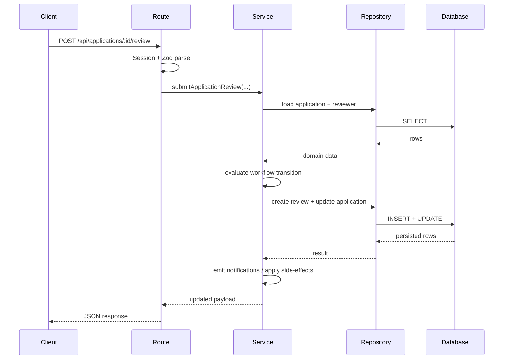
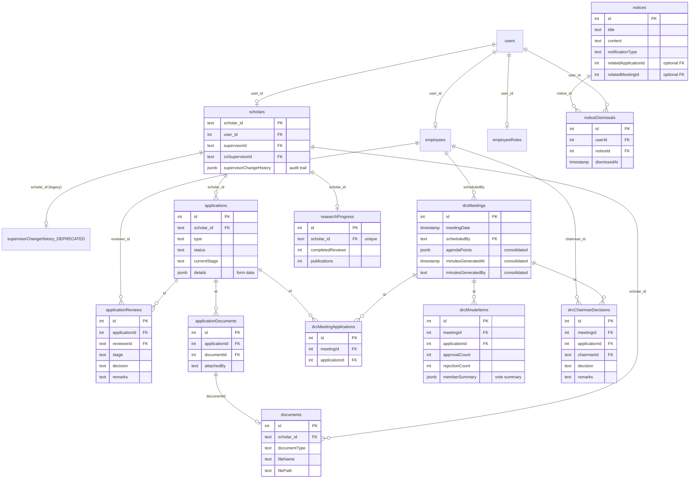
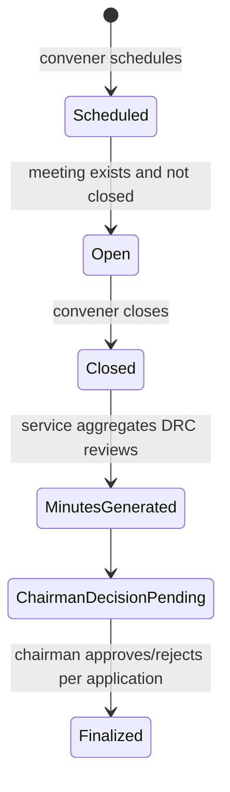

# DRC Capstone Project: Technical and Implementation Report

## Abstract

This report presents the technical design and implementation analysis of the DRC Capstone platform, a full-stack workflow system for postgraduate scholar lifecycle and academic review governance. The system digitalizes scholar-facing applications (e.g., Extension, Re-Registration, Supervisor Change, Thesis Submission), multi-stage approvals (Supervisor → DRC → IRC → DoAA), DRC meeting agenda/minutes operations, document management, and role-scoped notifications. The implementation follows a layered backend architecture (routes/services/repositories), shared type-safe contracts using Zod + Drizzle schemas, and a role-driven frontend with React Query and route guards.

The backend is implemented with Express + TypeScript and PostgreSQL via Drizzle ORM, while the frontend uses React + Vite with role-aware dashboards. The system exhibits strong separation of concerns, explicit input validation, predictable workflow state transitions, and repository-level persistence isolation. This report details the architecture, data model, request pipeline, state machines, critical services, security model, testing strategy, and technical evaluation.

---

## 1. System Context and Problem Framing

The platform addresses administrative complexity in doctoral governance where multiple stakeholders (scholars, supervisors, DRC members, IRC, DoAA, conveners, chairman, admin) process time-sensitive application workflows and decisions. The core technical challenge is not merely CRUD; it is *orchestration* across:

- Role-based access and identity models.
- Stage-constrained transitions with terminal outcomes.
- Event-like side effects (notifications, scholar profile updates, meeting minutes generation).
- Artifact lifecycle management (documents and enclosures).
- Institutional records that must preserve traceability (review records, chairman decisions, history tables).

The project implements this as a domain-specific workflow engine around a normalized relational schema.

---

## 2. Technology Stack and Runtime Model

### 2.1 Backend

- **Node.js + TypeScript (ESM)**.
- **Express 5** as HTTP framework.
- **express-session** for session-backed authentication context.
- **Drizzle ORM** with **PostgreSQL** driver (`pg`) for strongly typed persistence.
- **Zod** for runtime validation and shared API contracts.
- **Multer** for multipart uploads.
- **PDFKit** for DRC agenda PDF generation.

### 2.2 Frontend

- **React 18** with **Vite**.
- **Wouter** for client-side routing.
- **TanStack React Query** for data fetching and cache orchestration.
- **Tailwind + Radix UI** component system.

### 2.3 Build/Test Tooling

- Type-check: `tsc`.
- Backend tests: Node built-in test runner (`tsx --test`).
- Migrations and schema evolution with Drizzle scripts.

The project is configured as a unified monorepo-like structure where `shared/` exposes schema/types/routes consumed by both client and server.

---

## 3. High-Level Architecture

### 3.1 Layered Backend Design

The backend follows a clean orchestration flow:

1. **Route layer**: HTTP parsing, session gate checks, input schema parsing, response/error shaping.
2. **Service layer**: business logic and workflow orchestration.
3. **Repository layer**: database read/write queries and joins.
4. **Storage facade**: compatibility abstraction over repositories.

This pattern is explicitly documented in contribution guidance and reflected consistently in module boundaries.

### 3.2 Architecture Diagram



### 3.3 Request Lifecycle (Typical)



---

## 4. Data Model and Schema Engineering

The schema is centered around role-partitioned identities and workflow records. The current schema contains 16 tables organized into five logical domains: **Identity & Access**, **Scholar Lifecycle**, **Application Workflows**, **DRC Meetings**, and **Documents & Notifications**.

### 4.0 Schema Overview Diagram



**Key Design Characteristics:**

- **Consolidation**: `supervisorChangeHistory`, `agendaPoints`, and meeting minutes metadata are now stored as JSONB fields in parent tables (scholars, drcMeetings) instead of separate tables.
- **No FK Constraints**: Database foreign keys are not enforced; referential integrity is maintained at the application layer.
- **JSONB for Flexibility**: `applications.details`, `drcMinuteItems.memberSummary`, and `scholars.supervisorChangeHistory` store structured but schema-free data.
- **Audit Trails**: `applicationReviews` is immutable; `supervisorChangeHistory` preserves all supervisor changes with timestamps.

### 4.1 Identity Partitioning

- `users`: authentication and role identity.
- `scholars`: scholar profile and lifecycle attributes (phase, programme, status, supervisor mapping).
- `employees`: employee profile (designation, department), reused across supervisor/DRC/IRC/DoAA roles.

This split avoids polymorphic null-heavy tables and supports role-specific joins.

### 4.2 Workflow Tables

- `applications`: type, status, currentStage, details JSONB, finalOutcome.
- `application_reviews`: immutable per-stage review decisions.
- `applicationDocuments`: link applications to required documents.

Notably, `details` is JSONB for flexible form payloads without forcing schema migrations for every form variant.

The `supervisorChangeHistory` audit trail is now consolidated as a JSONB field within the `scholars` table, preserving the full chain of supervisor changes with timestamps while reducing schema complexity.

### 4.3 DRC Meeting Subdomain

- `drc_meetings`: meeting lifecycle (scheduled date, open/closed state). Now includes:
  - `agendaPoints` (JSONB array) - replaces former `drc_agenda_points` table
  - `minutesGeneratedAt` + `minutesGeneratedBy` (timestamp fields) - replace former `drc_meeting_minutes` table
- `drc_meeting_applications`: N-to-N junction: which applications are discussed in which meetings.
- `drc_minute_items`: per-application summary in meeting minutes (approval/rejection vote counts, member votes).
- `drc_chairman_decisions`: chairman's terminal decision after DRC member votes.

This design models meeting lifecycle from scheduling to closure, then post-meeting chairman-level finalization, with consolidation of metadata reducing join complexity.

### 4.4 Notification and Document Subsystems

- `notices` + `notice_dismissals` (with unique index by user and notice).
- `documents` with verification metadata (`isVerified`, `verifiedBy`, `verifiedAt`).

The document model stores file system path and metadata while preserving verification traceability.

---

## 5. Domain Workflow Engine

The workflow module (`server/workflow.ts`) defines stage progression as a deterministic state machine.

### 5.1 Stage Topology

- `supervisor` → `drc` → `irc` → `doaa` → `completed`.
- Rejection at any stage transitions directly to terminal state with final outcome `Rejected`.
- Approval moves to next stage; only terminal approval yields `Approved` final outcome.

### 5.2 Role Authorization Model

The workflow definition contains `stageRoles` so authorization and transition semantics are decoupled from route handlers. This prevents ad-hoc role checks and centralizes business rules.

### 5.3 Application-Type Overrides

Default workflow can be overridden per application type (`workflowByApplicationType`), enabling future path specialization (e.g., alternate paths for thesis workflows).

---

## 6. Service Layer Deep Dive

### 6.1 Review Workflow Service

`submitApplicationReview` is the core orchestration unit:

1. Loads application and verifies pending state.
2. Validates reviewer existence.
3. Resolves applicable workflow for the application type.
4. Enforces special supervisor-to-scholar assignment constraint at supervisor stage.
5. Persists review record.
6. For non-DRC stages, computes transition and updates application.
7. On terminal approval, executes type-specific post-approval side effects.
8. Emits notifications for scholar and next reviewer group.

#### 6.1.1 Approval Side Effects

Approved terminal decisions trigger semantic updates:

- **Supervisor Change**: validate proposed supervisor role, update scholar supervisor, write history record.
- **Extension**: parse duration, accumulate extension months, stamp approval timestamp.
- **Thesis Submission**: mark lifecycle as `Awarded`, status `Graduated`, phase update.
- **Re-Registration / Deregistration / Termination**: synchronize scholar lifecycle states.

This approach provides a practical *domain event handler* pattern without introducing a message broker.

### 6.2 DRC Meeting Service

The DRC meeting service is a second orchestration core:

- Scheduling validates convener role and ensures single open meeting invariant.
- Pending DRC-stage applications are snapshotted into meeting agenda mappings.
- Extra agenda points are normalized and persisted.
- Closing meeting generates minutes by aggregating DRC review counts and member summaries.
- Chairman decisions then finalize application transitions from DRC stage.

#### 6.2.1 Meeting Lifecycle Diagram



### 6.3 Notification Service

Notifications are role-targeted notices persisted for role channels and user-specific dismissal. In `test` runtime they are no-op to keep tests deterministic.

### 6.4 Application Eligibility and Enclosures

- Eligibility engine currently returns advisory/enforced-structured payloads with all supported types eligible by default.
- Enclosure snapshot service attaches document requirement evidence into application `details.enclosures` at submission time, preserving historical evidence even if documents later mutate.

---

## 7. API Contract and Validation Strategy

The project uses **shared route contracts** in `shared/routes.ts`, defining paths, methods, Zod input schemas, and output schemas consumed by both client and server.

### 7.1 Benefits

- Eliminates drift between frontend assumptions and backend implementation.
- Enables compile-time and runtime schema coherence.
- Improves maintainability for evolving endpoints.

### 7.2 Error Model

`ApiError` wrappers normalize 400/401/403/404 semantics. Route helper utilities parse IDs strictly (`positive integer only`) and unify error response shapes. Zod validation errors are mapped to predictable API payloads.

---

## 8. Authentication, Session, and Security Controls

### 8.1 Session Authentication

- Session cookie is configured `httpOnly`, `sameSite=lax`, and `secure` in production.
- Session stores `userId`, plus OAuth state.

### 8.2 Credential Validation

- Password verification uses bcrypt compare.
- A legacy password migration path exists: if stored password equals plaintext input (legacy mode), system updates through `updateUser` path.

### 8.3 OAuth Integration

Google OAuth start/callback is implemented with state token verification and account binding by email.

### 8.4 File Upload Security

Document uploads enforce:

- MIME allow-list (PDF/JPEG/PNG).
- 10 MB size cap.
- Controlled upload directory creation.

This mitigates arbitrary file upload vectors, though deeper content scanning could be future hardening.

### 8.5 Logging Hygiene

API logging includes response previews outside production but redacts sensitive keys via configurable redaction list.

---

## 9. Frontend System Design

### 9.1 Client Composition

- Root app wraps routes with React Query provider and toaster notifications.
- Session bootstrap calls `/api/auth/me`; unauthenticated users are routed to login.

### 9.2 Role-Driven Navigation

`role-config.ts` maps each role to valid paths, default landing pages, and sidebar content. This realizes role-specific UX partitioning while sharing a common shell.

### 9.3 Data Layer

Custom hooks + `apiRequest` abstraction provide typed requests, credential inclusion by default, and standardized `ApiClientError` behavior. Query defaults disable noisy refetch and retries to preserve deterministic dashboard behavior.

### 9.4 Frontend Route Topology Diagram

```mermaid
graph TD
  A[/] --> H[Home controller]
  H -->|no session| L[Login page]
  H -->|session restored| D[HomeDashboard]

  D --> S1[/scholar/*]
  D --> S2[/supervisor/*]
  D --> S3[/reviewer/*]
  D --> S4[/chairman/*]
```

---

## 10. Persistence and Query Design

### 10.1 Repository Pattern Strengths

Repositories encapsulate joins, projection shaping, ordering, and persistence normalization (e.g., date parsing in application inserts/updates). This limits query leakage into services and supports isolated testing through method mocking.

### 10.2 Postgres/SSL Handling

Database initialization normalizes `DATABASE_URL` by stripping conflicting SSL parameters and supports CA-file-based TLS in production-oriented settings. This is robust for managed DB providers with strict TLS requirements.

### 10.3 Migration Footprint

The repository includes sequential migration scripts for schema normalization, DRC meeting features, lifecycle status additions, notice metadata, and review-model adjustments. This indicates iterative domain expansion with explicit migration history.

---

## 11. Testing and Verification Strategy

### 11.1 Implemented Tests

The project uses service-centric tests that mock storage/repositories in memory:

- Review workflow error paths and transition paths.
- Terminal approval side effects (extension accumulation, supervisor change history).
- DRC notification listing/clearing authorization checks.
- Enclosure snapshot generation.
- HTTP utility parsing tests.

### 11.2 Methodological Evaluation

This test style is suitable for undergraduate capstone scope because it validates domain orchestration without requiring full integration infrastructure. It emphasizes correctness of business logic (highest defect-risk layer).

### 11.3 Recommended Additional Technical Evaluation

For stronger academic rigor, include in future iterations:

1. **Integration tests** with ephemeral Postgres (testcontainers) for repository correctness.
2. **Property-based tests** for workflow transitions (state-machine invariants).
3. **Performance tests**:
   - Application list latency under increasing row counts.
   - DRC minutes generation complexity vs number of applications/reviews.
4. **Security tests**:
   - Session fixation and CSRF threat simulations.
   - Malicious file upload bypass attempts.
5. **Mutation testing** for business rule resilience.

---

## 12. Technical Methodology (System Design to Implementation)

The development methodology visible from structure and code conventions resembles a layered incremental approach:

1. **Schema-first domain modeling** in `shared/schema.ts`.
2. **Contract-first API definitions** in `shared/routes.ts` with Zod.
3. **Route/service/repository decomposition** to enforce separation of concerns.
4. **Service-first test coverage** for orchestration-critical features.
5. **Migration-driven evolution** for new modules (DRC meetings, notices, lifecycle fields).

This methodology aligns with practical software engineering principles taught at undergraduate level: modular decomposition, typed contracts, testable units, and maintainable persistence evolution.

---

## 13. Strengths, Limitations, and Engineering Trade-offs

### 13.1 Strengths

- Strong modular boundaries.
- Unified type contracts between frontend/backed.
- Explicit workflow state machine and deterministic transitions.
- Role-aware access checks in both route and service layers.
- Extensible JSONB-backed application details with enclosure snapshots.
- Real administrative workflows (meeting agenda → minutes → chairman decisions).

### 13.2 Current Limitations

- Eligibility logic is presently permissive/default (rules are placeholder-like).
- Session store defaults may need hardened persistent store for production scale.
- Document validation is MIME-based (no deep content inspection).
- Limited integration/performance security benchmarking artifacts in repo.
- Potential type coercion via `as any` in some repository projections should be reduced.

### 13.3 Trade-offs

- **JSONB flexibility vs strict normalization**: chosen flexibility accelerates form evolution but shifts some validation burden to services.
- **Service tests over full integration**: improves speed and development flow but may miss DB-level edge cases.
- **Monolithic deployment**: simpler capstone operations, but less horizontally scalable than decomposed services.

---

## 14. Conclusion

Technically, the DRC Capstone project demonstrates a mature full-stack architecture for academic process automation. The implementation goes beyond CRUD by encoding institutional governance workflows, role-constrained decisions, meeting-driven approval gates, and traceable post-approval side effects. Its shared contract model and layered backend provide maintainability and correctness benefits suitable for real departmental operations.

For undergraduate academic standards, the project is strong in architecture, implementation depth, and domain modeling. With additional integration benchmarking and security hardening experiments, it can evolve from robust capstone-grade software into a production-grade academic governance platform.

---

## Appendix A: Suggested Figure Captions for Submission

1. **Figure 1**: Layered architecture of DRC Capstone platform (client, route, service, repository, database).
2. **Figure 2**: Review submission sequence from HTTP request to workflow transition and notification emission.
3. **Figure 3**: DRC meeting lifecycle state model from schedule to chairman finalization.
4. **Figure 4**: Role-driven frontend route navigation model.

## Appendix B: Suggested Evaluation Metrics Table (for your final write-up formatting)

| Metric | Definition | Collection Method |
|---|---|---|
| Review Transition Correctness | % transitions matching workflow definition | Automated service tests |
| Mean Review Submission Latency | Avg API response time for `/review` | Timed load test |
| Minutes Generation Throughput | Applications processed per second during minute generation | Batch test harness |
| Notification Dispatch Reliability | % successful notice insertions per event | DB audit comparison |
| Upload Validation Effectiveness | % blocked invalid uploads | Security test suite |
